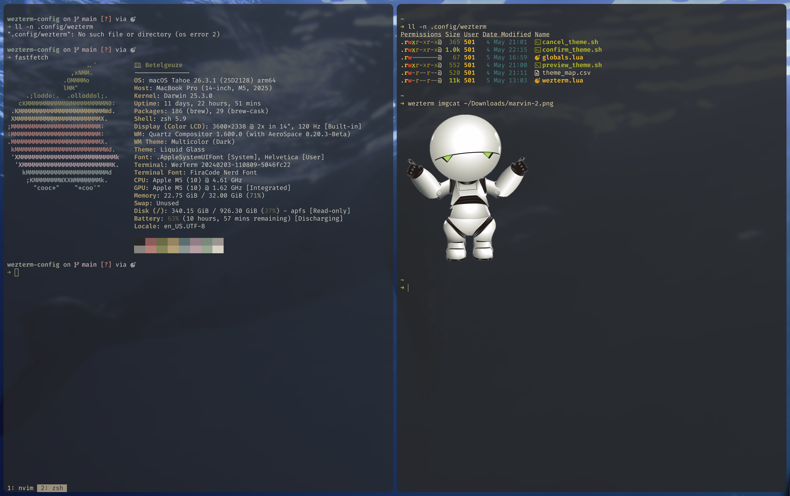

My WezTerm, Neovim and Aerospace config



## Requirements

- [WezTerm](https://wezterm.org/)
- bash
- [fzf ](https://github.com/junegunn/fzf)
- [Neovim ](https://neovim.io/) (optional)
- [smart-splits.nvim](https://github.com/mrjones2014/smart-splits.nvim#install) (optional)
- [Aerospace ](https://github.com/nickolay-krets/aerospace) (optional)
- [bat ](https://github.com/sharkdp/bat) (optional)

There’s some MacOS / zsh specific stuff in here, but it shouldn’t be too hard to adapt.

## Features

### Seamless navigation between splits

One set of keybinds moves between panes, Aerospace windows, Neovim windows

### Opacity toggle

Keybind to cycle:

- All windows transparent, unfocused windows more so
- Transparency only on unfocused windows
- No transparency

### Unfocused window / pane desaturation

Toggle:

- Desaturation of unfocused windows. Muted colors based on current theme

In addition, desaturation of unfocused panes can be toggled in wezterm.lua

### Theme picker for WezTerm, Neovim, bat

Fuzzy theme picker:

- Keybinds to filter dark/light themes
- Live preview in all windows
- Choosing a wezterm theme synchronizes to `bat` and `nvim`. 
  - Updates env var exports BAT_THEME and NVIM_THEME in ~/.zshrc.local, changes applied after sourcing
  - Only env vars already exported by `~/.zshrc.local` (configurable) are changed
  - Mappings present for catppuccin, tokyonight and gruvbox. Other themes fall back to catppuccin
- theme list is built dynamically (and filtered for duplicates) so it works with WezTerm nightly builds
- Shell scripts (no lua dependency) with atomic writes to prevent race condition
- Tab bar follows window styling

Based on [wezthemes](https://github.com/CheikhNaro/wezthemes)

### Misc

Smart split: create a vertical or horizontal split depending on the current pane's shape.

Smart split navigation: if in Neovim, pass commands through; otherwise navigate WezTerm panes. At the edge of the pane layout, falls through to Aerospace to focus the neighboring window.

Keybind to open `wezterm.lua`: in [ chezmoi ](https://www.chezmoi.io/) if present, `$EDITOR` otherwise

## Install

Copy `wezterm/*` to `~/.config/wezterm` 

### Optional:

add to .zshrc:

```bash
if [ -f ~/.zshrc.local ]; then
  source ~/.zshrc.local
fi

function _check_zshrc_local() {
  [ ! -f ~/.zshrc.local ] && return
  local mtime=$(stat -f %m ~/.zshrc.local)
  if [[ $mtime != $_zshrc_local_mtime ]]; then
    _zshrc_local_mtime=$mtime
    source ~/.zshrc.local
  fi
}
precmd_functions+=(_check_zshrc_local)
```

create or edit .zshrc.local:

```bash
export NVIM_THEME=catppuccin
export BAT_THEME="Catppuccin Mocha"
```

Configure Neovim to use `$NVIM_THEME` (example for LazyVim):

```lua
-- ~/.config/nvim/lua/plugins/colorscheme.lua
  {
    "LazyVim/LazyVim",
    opts = {
      colorscheme = os.getenv("NVIM_THEME") or "tokyonight",
    },
  },
```

Install [smart-splits.nvim](https://github.com/mrjones2014/smart-splits.nvim#install)

- Example config in `/nvim`

Change Aerospace `Ctrl+HJKL` keybinds to something else, so WezTerm receives these.

## Keybinds

Leader key is `mod+L` (timeout 2 s). 
`mod` is `⌘+Shift` on macOS; `Ctrl+Shift` on Windows.

### Features


| Keys | Action |
|---|---|
| `<leader>T` | Open theme picker |
| `<leader>O` | Cycle opacity modes |
| `<leader>D` | Toggle unfocused-window desaturation |


In theme picker:


| Keys | Action |
|---|---|
| `Ctrl+T` | Cycle dark/light/all themes |
| `Ctrl+J/K` | Line down/up |


### Splits, Tabs & Windows


| Keys | Action |
|---|---|
| `mod+Enter` | Smart split |
| `mod+\|` | Split horizontal |
| `mod+-` | Split vertical |
| `<leader>R` | Rotate panes clockwise |
| `⌘+T` | New tab |
| `⌘+N` | New window |
| `⌘+W` | Close current pane/tab/window |


### Pane Selection & Zoom


| Keys | Action |
|---|---|
| `<leader>S` | Pane select overlay |
| `<leader>Z` | Toggle pane zoom |


### Navigation

These keys are forwarded to Neovim when the active pane is running nvim, otherwise they navigate WezTerm panes. At the edge of the pane layout, focus moves to the neighboring Aerospace window.


| Keys | Action |
|---|---|
| `Ctrl+H/J/K/L` | Move focus left / down / up / right |
| `Ctrl+Arrow` | Resize pane in the arrow direction |


Also works for `Ctrl+J` and `Ctrl+K` in theme picker, fzf.

### Misc


| Keys | Action |
|---|---|
| `⌘+,` | Edit wezterm.lua (via chezmoi) |
| `Opt+←/→` | Jump word left / right |


